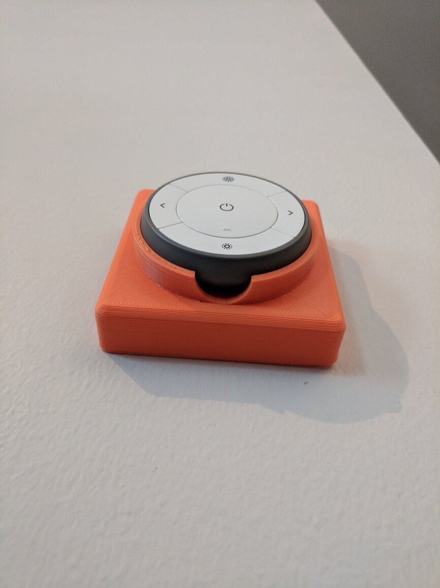

# Test print history

## Tagged `print-001`

Testing how the puck fits, and stays in place.

## Tagged `print-002`

Testing thinner walls, and larger access hole at the bottom.

## Tagged `print-003`

First iteration of mount points for the assembly.

## Tagged `print-004`

Adjusted dimensions for mount points.

## Tagged `print-005`

First fully functional prototype.

## Tagged `print-006`

Test fitting over a 2-unit switch.

